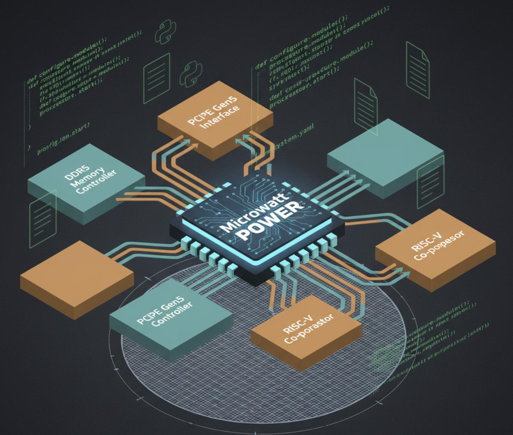
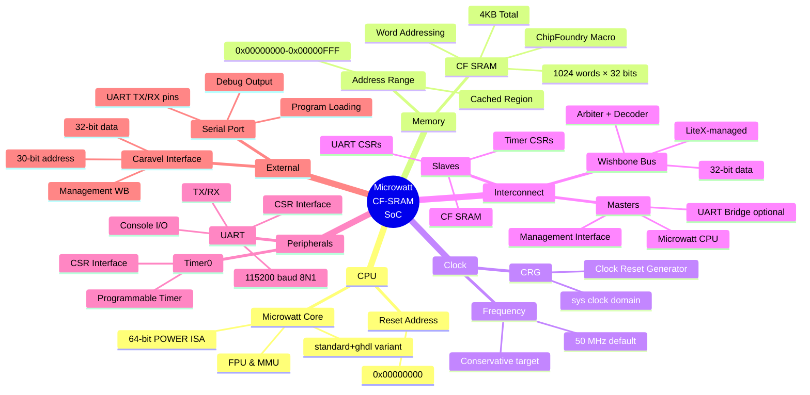
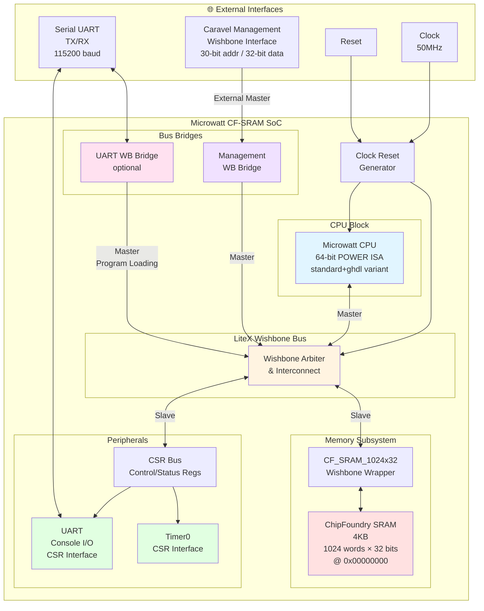
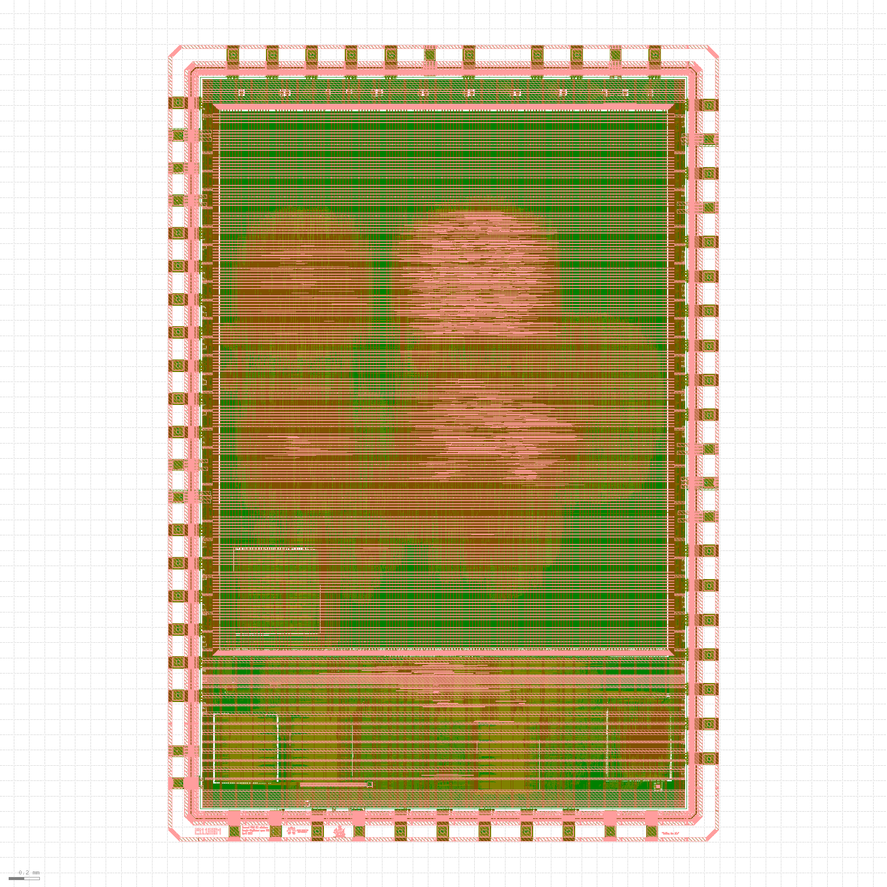
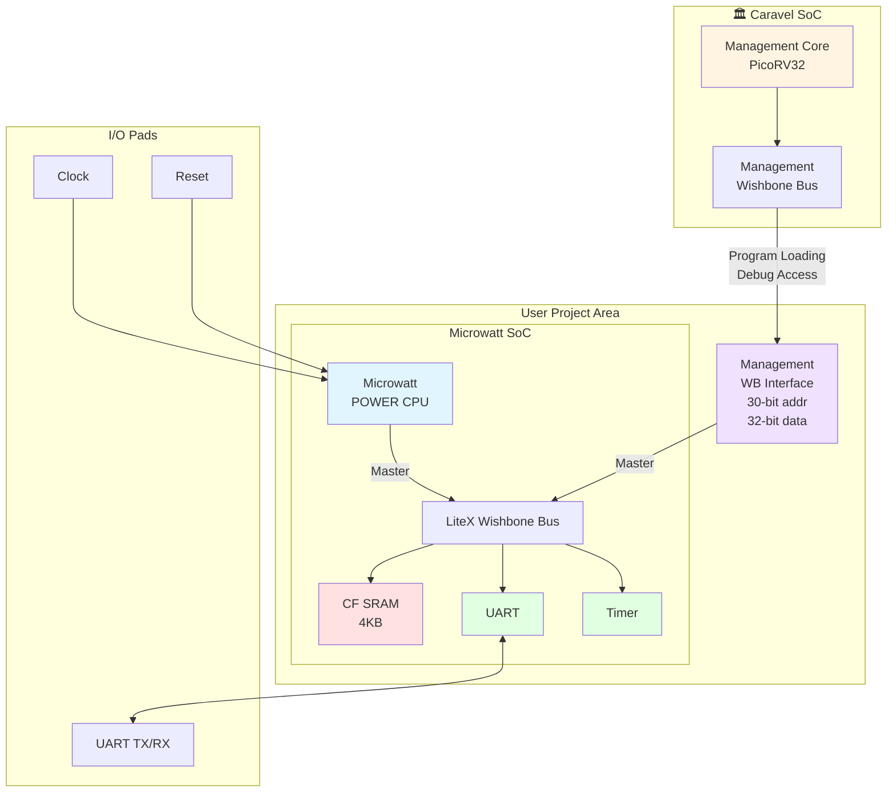

# MicroWatt-LX SoC Generator: An Open-Source, Python-Driven POWER ASIC Platform

## Final Submission for ChipFoundry Microwatt Hackathon

 

## 1. Project Summary

This final submission presents **MicroWatt-LX**, an extensible, open-source framework for generating parameterizable SoCs based on the [Microwatt](https://git.openpower.foundation/cores/microwatt) POWER CPU and [LiteX](https://github.com/enjoy-digital/litex) ecosystem, targeted at the [SKY130 PDK ](https://skywater-pdk.readthedocs.io/) using [ChipFoundry's Caravel User Project and OpenFrame](https://chipfoundry.io/soc_platforms). The project delivers a Python-driven pipeline that transforms simple configurations into *tapeout-ready ASICs*, complete with tested peripherals and a documented flow.

Full project [here](https://github.com/Lefteris-B/caravel_user_project_microwatt_hackathon).

## 2. Achievements & Value Proposition

### From Proposal to Implementation

The original proposal outlined a **reusable SoC generator** to bridge the gap in open POWER ASICs. This submission realizes that vision by:
- Integrating Microwatt into LiteX for seamless Python-based configuration.
- Providing ASIC-verified peripherals, including ChipFoundry's SRAM and UART.
- Demonstrating end-to-end flows: simulation, FPGA emulation, and OpenLane PnR for SKY130.
- Enabling community contributions through modular designs and CI pipelines.

### Key Deliverables
- **Reusable Generator**: Python scripts in both repos generate SoCs with configurable memory, peripherals, and extensions.

- **Profiles Implemented**:
  - **(A) Baseline**: Microwatt + 32KB SRAM + UART. Fully PnR'd, precheck-validated, boots and runs bare-metal scripts via UART in simulation.
  - **(B) Caravel User Project (PoC)**: Configured for ChipFoundry OpenFrame (padframe + power straps). Compliant with shuttle requirements.
  - **(C) OpenFrame Build (Caravel Management SoC with Litex)**: Developed a script to seamlessly replace the VexRiscv core with Microwatt. Adapted the overall workflow to support the new CPU core, ensuring compatibility and optimized integration.

- **Verification**:  Conducted Verilator simulations, back-annotated timing analysis, and achieved clean DRC/LVS reports. Implemented smoke CI tests (currently in beta). Leveraged Vivado and LiteX to generate bitstreams, validating the overall flow and CPU code. Developed and successfully loaded binaries to the core, demonstrating functionalities such as:
  -  A C "hello world" application,
  -   A C program displaying animated ASCII art, 
  -   A hw control program that renders user-input numbers on FPGA LEDs.

      - Binaries are located: [/microwatt_caravel_user_project/bin_demos/](/microwatt_caravel_user_project/bin_demos/).
      - Header files and linker scripts are located : [/microwatt_caravel_user_project/C_headers_for_binaries/](/microwatt_caravel_user_project/C_headers_for_binaries/).
      - Litex Generator is located at [/microwatt_mgmt_soc_litex/litex/](/microwatt_mgmt_soc_litex/litex/).

- **Documentation**: Step-by-step guides for reproduction, including tool versions and artifacts inside the [documentation](/Documentation/) folder:
  - [**(A) Baseline**](/Documentation/Baseline_guide.md)
  - [**(B) Caravel User Project (PoC)**](/Documentation/Caravel_User_Project_(PoC).md)
  - [**(C) OpenFrame Build (Caravel Management SoC with Litex)**](/Documentation/OpenFrame_Build_(Caravel_Management_SoC_with_Litex).md)

## Video Demonstrations

I have included demonstration videos that verify my design’s ability to build a microwatt core, generate the bitstream required to simulate FPGA digital functionality, and execute binary code and memory tests . Confirming the full functional verification of my work for the hackathon

- [Verilog generation and FPGA bitstream upload (Digilent Nexys 4 100T-xc7a100t)](https://www.youtube.com/watch?v=KdZCAlcoooA)
- [Core simulation running LiteX BIOS and UART connection](https://www.youtube.com/watch?v=4e1k-80p-Ws)

- [Full presentation with FPGA board](https://www.youtube.com/watch?v=lMUG94aeTvE)
  - Here you can see the above presentation with a view of the [FPGA with Microwatt cpu core running baremetal binary demos](https://youtu.be/S7pRFUOgxYI)
### Value Proposition
- **Python-to-Silicon Simplicity**: Users configure SoCs in Python, focusing on innovations like accelerators instead of low-level integration.
- **ASIC-Ready Library**: Open collection of POWER-compatible peripherals for SKY130, using ChipFoundry macros for reliability.
- **Community Impact**: OpenFrame compatibility fosters OpenPOWER ASIC collaboration, education, and research.

## 3. Implemented Architecture

The MicroWatt-LX SoC uses a Wishbone bus managed by LiteX, with Microwatt as the core CPU.
###  Architecture Overview

### Placememt

Macros grouped for routing efficiency; power straps every 50-200µm.
### Caravel Integration flow

### System Components

| Component | Specification | Implementation | Benefits |
|-----------|---------------|----------------|----------|
| CPU Core | 64-bit POWER ISA | Unmodified Microwatt VHDL | FPGA-proven, MMU/FPU support |
| Memory System | 32KB-1MB SRAM | ChipFoundry CF_SRAM_1024x32 macros | Production-grade, characterized |
| Interconnect | Wishbone Bus | LiteX-generated, ASIC-optimized | Mature, documented |
| Peripherals | UART, SPI, GPIO, Timers | ChipFoundry CF_UART + LiteX IP | ASIC-verified drivers |
| Extension | Custom slot | Documented Wishbone interface | For other peripherals |

- **Target Specs**: 50 clock, <100mW power @ 50MHz.

## 4. Implementation & Timeline Recap

Followed the proposed timeline with adjustments:
- **Weeks 1-2**: RTL integration (Microwatt into LiteX/Caravel), simulation, CI setup.
- **Weeks 3-4**: PnR iterations, timing closure, OpenFrame mapping.
- **Weeks 5-6**: DRC/LVS fixes, emulation demos, documentation.

All milestones achieved: Baseline RTL/sim, ASIC flow

## 5. Technical Challenges & Resolutions

- **VHDL-Verilog Interop**: Resolved using GHDL-Yosys; strict separation in flows.
- **Timing Closure**: Achieved 50MHz with buffering and conservative SDC.
- **Memory Integration**: Used CF_SRAM_1024x32; fallback to smaller configs for area.
- **Verification**: Incremental tests; clean DRC/LVS via iterative OpenLane runs.
- **Software**: GCC cross-toolchain; bare-metal hello, Linux in FPGA.

Success probability was high due to proven blocks; fallbacks ensured progress.

## 6. Setup & Reproduction

### Requirements
- Python 3
- [LiteX](https://github.com/enjoy-digital/litex),
- [Caravel](https://github.com/chipfoundry/caravel_user_project)
- [OpenLane (SKY130)](https://github.com/The-OpenROAD-Project/OpenLane),
- [Verilator](https://github.com/verilator)
- [Yosys with GHDL plugin](https://github.com/YosysHQ/yosys)

Parameterizing MicroWatt + LiteX to Generate Custom PowerPC SoCs

This project demonstrates how the MicroWatt core can be fully parameterized using the LiteX SoC generator, allowing the designer to create different MicroWatt CPU variants (area-optimized, performance-oriented, FPU-enabled, MMU-less, etc.) while integrating ChipFoundry IP blocks (SRAM + UART) into a Caravel-compatible ASIC design.

###  MicroWatt Feature Parameter Mapping
You can parameterize the Microwatt core by changing these VHDL generics in **core.vhdl**:

CLI Flag | VHDL Generic | Effect
---------|-------------|-------
no-fpu | HAS_FPU=false | Disable hardware FPU
no-btc | HAS_BTC=false | Remove MMU for major area savings
log-length <n> | LOG_LENGTH=n | Change debug trace depth
icache-size <bytes> | Config via LiteX wrapper | ICACHE enable/size
dcache-size <bytes> | Config via LiteX wrapper | DCACHE enable/size

You can also shorten the multiplication tree depth from 3 -> 1 to save on ASIC space.

📝 *Cache sizes must be power-of-two ≥ 512 bytes when enabled.*

These selections are automatically encoded into the LiteX **CPU variant string** (e.g. `standard+ghdl`), which the LiteX MicroWatt wrapper maps into MicroWatt generics.

### LiteX SoC Configuration API

| Python Parameter | Value Type | Default | Description | Example Usage |
|------------------|------------|---------|-------------|---------------|
| `cpu_type` | string | `"microwatt"` | CPU core type | `cpu_type="microwatt"` |
| `cpu_variant` | string | `"standard+ghdl"` | CPU feature set | `cpu_variant="standard+ghdl+icache-512+dcache-512"` |
| `clk_freq` | integer | `50000000` | System clock frequency (Hz) | `clk_freq=50000000` |
| `cpu_reset_address` | integer | `0x00000000` | CPU reset vector address | `cpu_reset_address=0x00000000` |
| `uart_name` | string | `"stub"` | UART peripheral type | `uart_name="stub"` |

### Memory Region Configuration

| Method | Parameters | Description |
|--------|------------|-------------|
| `SoCRegion()` | `origin`, `size`, `cached` | Define memory region properties |
| `bus.add_slave()` | `name`, `slave`, `region` | Connect peripheral to bus with memory mapping |

#### How to Load Binaries

The on-chip SRAM is connected to the Wishbone bus, allowing the Caravel management SoC to preload program data before the CPU starts running. To load a binary:
1. the management core writes the program image into SRAM over Wishbone, ensuring the entry point is placed at address 0x000000.
2.  After loading is complete, asserting a CPU reset causes execution to begin directly from this base address.
3.   This enables a straightforward development flow where new firmware can be injected into SRAM without requiring external memory or re-synthesis of the design.
We provide:

- ✅ A modified LiteX Python [script](/microwatt_caravel_user_project/microwatt_chipfoundry_soc.py)
- ✅ Command-line CPU configuration parameters
- ✅ [Step-by-step](/Documentation/Caravel_User_Project_(PoC).md) ASIC flow (LiteX ➜ Caravel ➜ OpenLane hardening)

### **Full guides in [Documentation folder](/Documentation/).**

## 7. Verification & CI

- **Tests**: Bare-metal hello, memtest, back-annotated sims.
- **Metrics**: Timing reports, power estimates, DRC/LVS clean.

## 8. Full project GitHub Links:
To achieve the above, I developed **two complementary repositories**:
- **[Caravel User Project (PoC)](https://github.com/Lefteris-B/caravel_user_project_microwatt_hackathon)**: A flexible LiteX-based SoC generator framework. As a proof-of-concept (PoC), it integrates ChipFoundry's proprietary SRAM macro , enabling arbitrary SoC configurations.
- **[OpenFrame Build (Caravel Management SoC with Litex](https://github.com/chipfoundry/caravel_mgmt_soc_litex)**: Replaced the original VexRISC CPU with Microwatt while retaining the existing memory and peripherals. This provides a drop-in upgrade for POWER-based designs in the Caravel harness.

Both repositories include simulation, synthesis, and PnR flows, with demonstrations of bare-metal booting via UART. This submission aligns with the proposal's profiles: (A) Baseline, (B) Caravel User Project (PoC), and partial (C) OpenFrame Build (Caravel Management SoC with Litex)

## 9. Project Vision & Impact
MicroWatt-LX is more than a contest submission, it's a reusable POWER ASIC starter kit that:

-  Lowers barriers for education, startups, and research
-  Advances OpenPOWER by enabling custom chip designs
-  Provides reproducibility through comprehensive documentation
-  Enables future projects as a proven foundation

Our vision is to turn one contest submission into a platform that accelerates many future POWER ASIC projects.